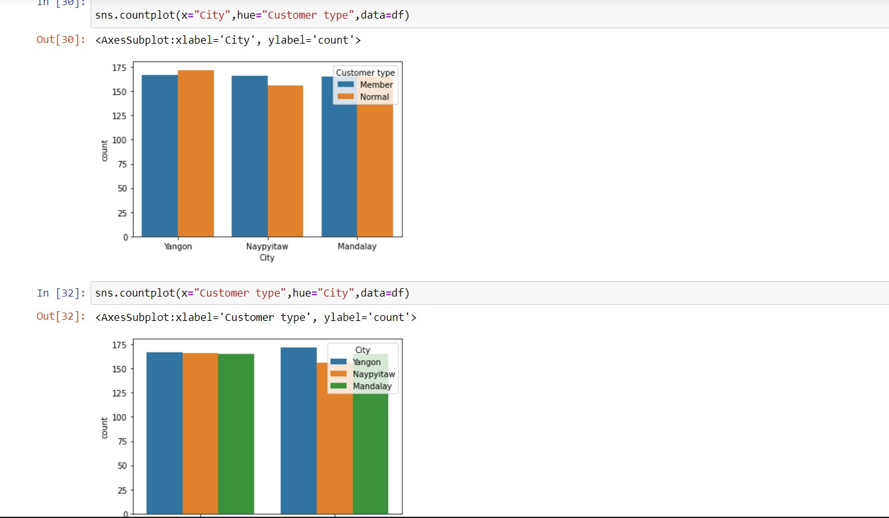

# Ex-04-EDA
# AIM:
To Perform the EDA method for the given data set.

# EXPLANATION :
The primary aim with exploratory analysis is to examine the data for distribution, outliers and anomalies to direct specific testing of your hypothesis.

# ALGORITHM:
### Step1:
Import the required packages(pandas,numpy,seaborn).

### Step2:
Read and Load the Dataset.

### Step3:
Remove the null values from the data and remove the outliers ,then use drop() to remove non numnerical datas.

### Step4:
Returns object containing counts of unique values using (value_counts()) and plot the counts in Bargraph or Histogram.

### Step5:
Finally find the pairwise correlation of all columns in the dataframe(.corr()) and save the final data set into the file.

### CODE:
```
import pandas as pd
import numpy as np
df=pd.read_csv("supermarket.csv")
print(df)
df.head()
df.info()
df.isnull().sum()
df.boxplot()
Q1 = df[cols].quantile(0.25)
Q3 = df[cols].quantile(0.75)
IQR = Q3 - Q1
df = df[~((df[cols] < (Q1 - 1.5 * IQR)) |(df[cols] > (Q3 + 1.5 * IQR))).any(axis=1)]
df.boxplot()
df["Total"].value_counts()
import matplotlib.pyplot as plt
plt.title('Grouped by Total')
import seaborn as sns
sns.countplot(x="Branch",data=df)
df["Payment"].value_counts()
plt.title('Grouped by Payment')
sns.countplot(x="Payment",data=df)
df["City"].value_counts()
plt.title('Grouped by City')
sns.countplot(x="City",data=df)
sns.countplot(x="Gender",hue="Product line",data=df)
sns.countplot(x="City",hue="Customer type",data=df)
sns.countplot(x="Customer type",hue="City",data=df)
sns.displot(df["Quantity"])
sns.displot(df[df["Branch"]=="A"]["Gender"])
sns.displot(df[df["Payment"]=="Credit card"]["Branch"])
pd.crosstab(df["City"],df["Branch"])
pd.crosstab(df["Gender"],df["Branch"])
pd.crosstab(df["Customer type"],df["City"])
df.corr()
sns.heatmap(df.corr(),annot=True)
```

### OUTPUT:





## RESULT:
Thus the given dataset is analysed using EDA method.